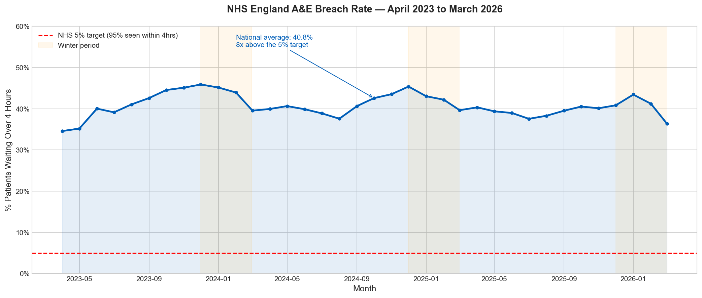
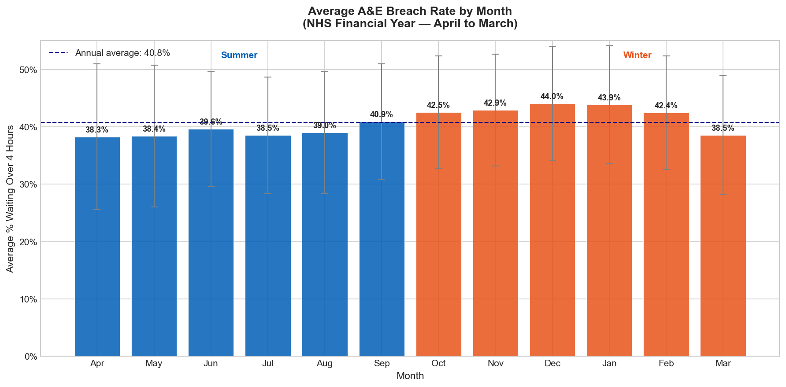
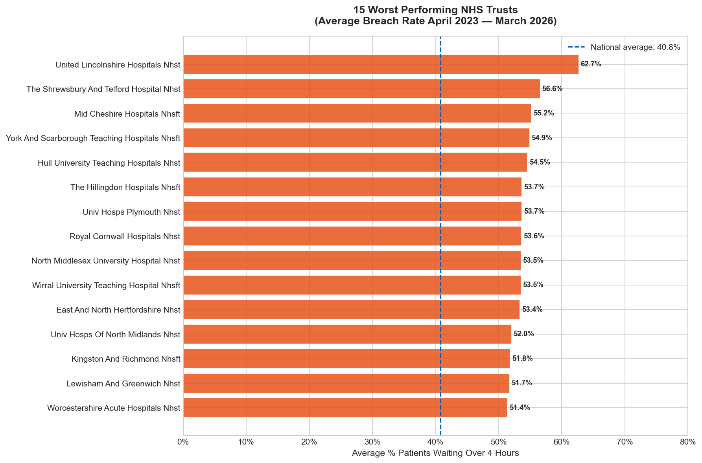
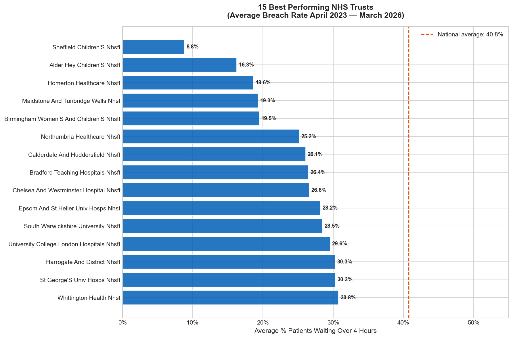
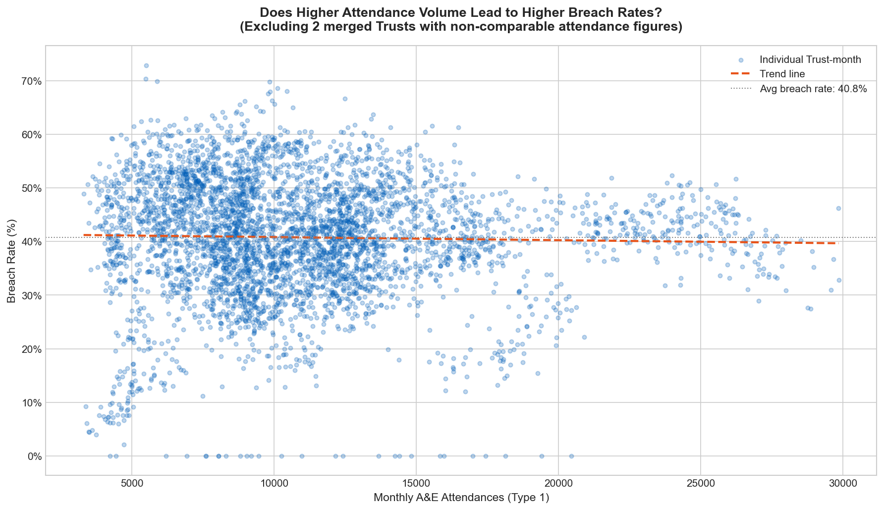
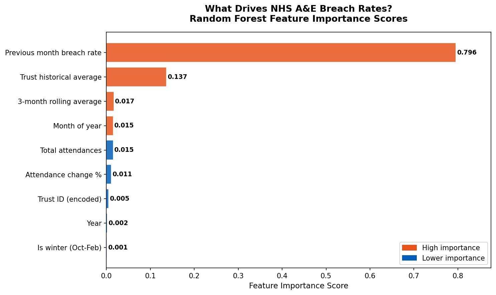
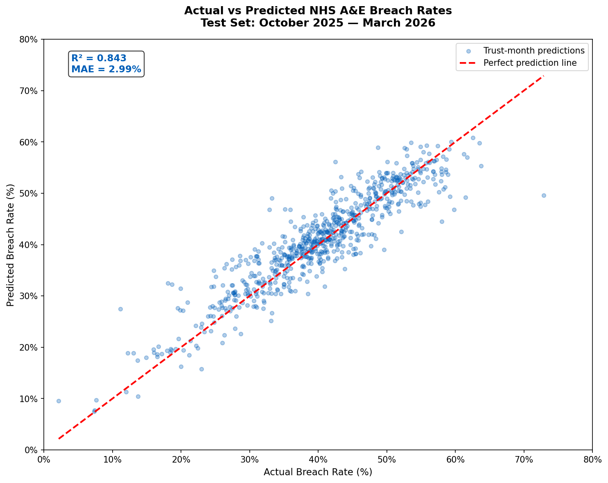

# NHS A&E Waiting Times — Predicting Pressure Points

A complete end-to-end data analytics and machine learning project using 
3 years of open government data from NHS England.

---

## The Problem

NHS A&E departments across England have consistently failed to meet the 
government's 4-hour waiting time target. This project analyses 36 months 
of monthly data (April 2023 — March 2026) across 132 NHS Trusts to:

- Identify which Trusts and seasons are under the most pressure
- Understand what actually drives A&E breach rates
- Build a machine learning model to predict when breach rates will spike

---

## Key Findings

- The national average breach rate is **40.8%** — 8x above the 5% target
- **December** is consistently the worst month at 45.9% breach rate
- Winter months are **4.4 percentage points** higher than summer
- The gap between the best and worst Trust is **53.9 percentage points**
- Attendance volume has almost **zero correlation** with breach rates (-0.026)
- A Trust's previous month performance is by far the strongest predictor

---

## Machine Learning Model

| Metric | Result |
|--------|--------|
| Algorithm | Random Forest Regressor |
| R² Score | **0.843** |
| Mean Absolute Error | **2.99%** |
| Predictions within 5pp | 81.9% |
| Predictions within 10pp | 97.8% |
| Training period | April 2023 — September 2025 |
| Test period | October 2025 — March 2026 |
---

## Project Structure

    nhs-ae-waiting-times/
    ├── data/
    │   ├── raw/              <- 36 monthly CSV files from NHS England
    │   └── processed/        <- Cleaned and feature engineered datasets
    ├── notebooks/
    │   ├── 01_data_loading.ipynb
    │   ├── 02_exploratory_data_analysis.ipynb
    │   ├── 03_feature_engineering.ipynb
    │   └── 04_modelling.ipynb
    ├── outputs/
    │   └── charts/           <- 7 publication quality charts
    └── README.md

---

## Charts

### National Breach Rate Trend

### Seasonal Pattern

### Worst Performing Trusts

### Best Performing Trusts

### Volume vs Breach Rate

### Feature Importance

### Actual vs Predicted

---

## Tools Used

Python · pandas · scikit-learn · matplotlib · seaborn · Jupyter Notebook

---

## Data Source

NHS England — A&E Attendances and Emergency Admissions  
Licence: Open Government Licence v3.0  
https://www.england.nhs.uk/statistics/statistical-work-areas/ae-waiting-times-and-activity/

---

## How to Run

1. Clone this repository
2. Install requirements: `pip install pandas matplotlib seaborn scikit-learn openpyxl xlrd`
3. Place NHS data files in `/data/raw/`
4. Run notebooks in order: 01 → 02 → 03 → 04
